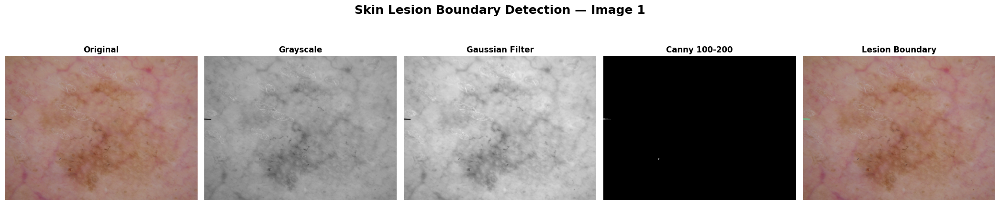
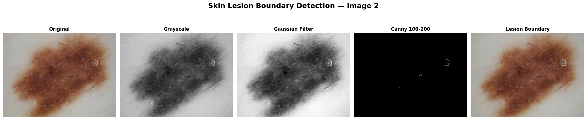
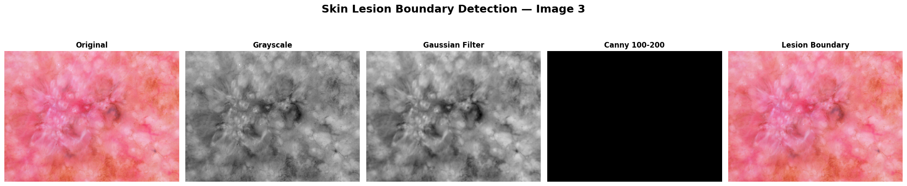
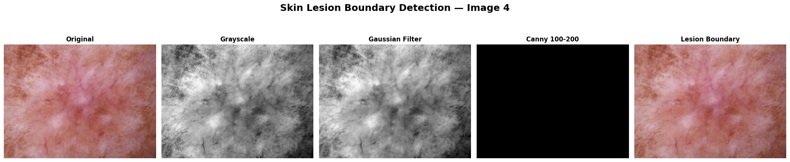
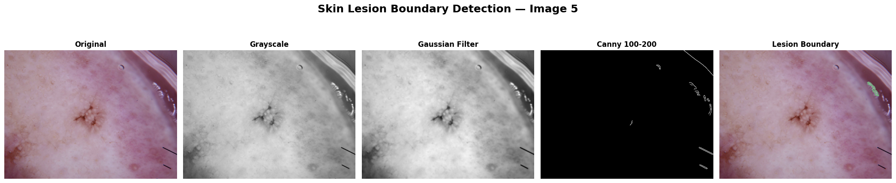
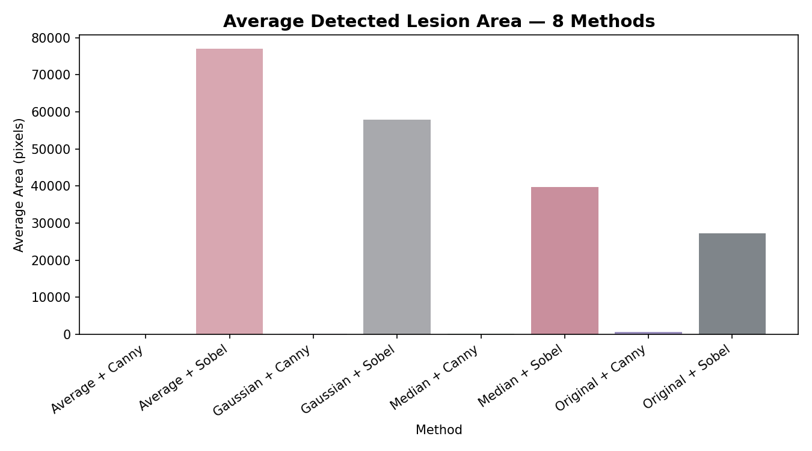
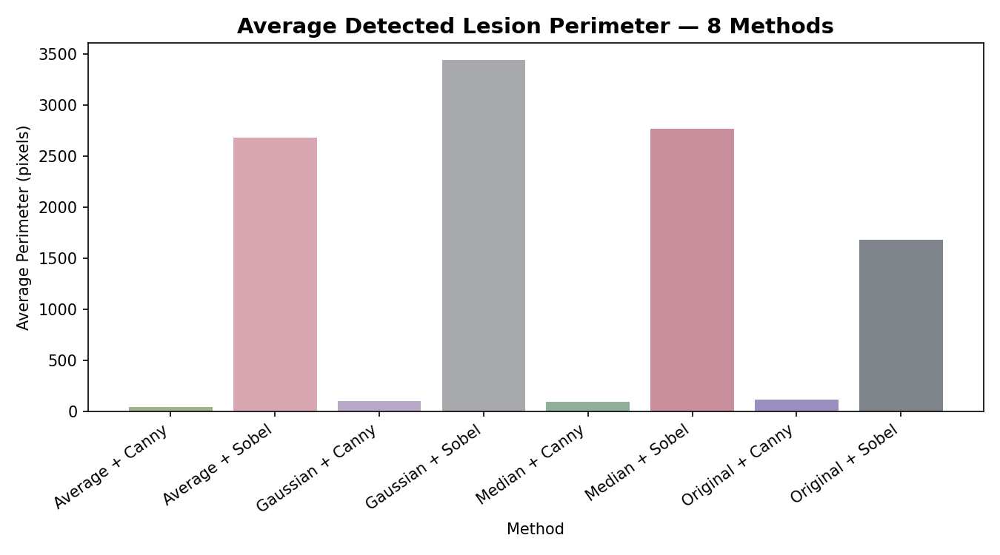

# Skin Lesion Boundary Detection Using Canny Edge Detection — Results

## Boundary Detection Pipeline (Best Threshold: Canny 100–200, Gaussian Filter)

### Table — Best Filter + Edge Method Results

| Image | Best Filter | Edge Method | Area (pixels) | Perimeter (pixels) |
|---|---|---|---|---|
| Image 1 | Gaussian | Canny 100-200 | 168.5 | 81.90 |
| Image 2 | Gaussian | Canny 100-200 | 317.5 | 297.66 |
| Image 3 | Gaussian | Canny 100-200 | 0.0 | 0.00 |
| Image 4 | Gaussian | Canny 100-200 | 0.0 | 0.00 |
| Image 5 | Gaussian | Canny 100-200 | 313.0 | 147.40 |

## Full Comparison — 8 Methods × 5 Images

| Image | Method | Area (pixels) | Perimeter (pixels) |
|---|---|---|---|
| Image 1 | Original + Sobel | 264.0 | 134.97 |
| Image 1 | Original + Canny | 165.5 | 81.07 |
| Image 1 | Average + Sobel | 377.0 | 95.31 |
| Image 1 | Average + Canny | 185.0 | 82.49 |
| Image 1 | Gaussian + Sobel | 309.0 | 91.31 |
| Image 1 | Gaussian + Canny | 168.5 | 81.90 |
| Image 1 | Median + Sobel | 236.0 | 86.14 |
| Image 1 | Median + Canny | 165.0 | 81.31 |
| Image 2 | Original + Sobel | 2117.0 | 208.85 |
| Image 2 | Original + Canny | 2152.0 | 211.68 |
| Image 2 | Average + Sobel | 3164.5 | 213.24 |
| Image 2 | Average + Canny | 0.0 | 0.00 |
| Image 2 | Gaussian + Sobel | 3013.5 | 211.58 |
| Image 2 | Gaussian + Canny | 317.5 | 297.66 |
| Image 2 | Median + Sobel | 2865.5 | 206.75 |
| Image 2 | Median + Canny | 386.5 | 240.89 |
| Image 3 | Original + Sobel | 4679.5 | 1148.52 |
| Image 3 | Original + Canny | 0.0 | 0.00 |
| Image 3 | Average + Sobel | 129697.5 | 7819.58 |
| Image 3 | Average + Canny | 0.0 | 0.00 |
| Image 3 | Gaussian + Sobel | 120005.0 | 8671.93 |
| Image 3 | Gaussian + Canny | 0.0 | 0.00 |
| Image 3 | Median + Sobel | 82871.5 | 7339.58 |
| Image 3 | Median + Canny | 0.0 | 0.00 |
| Image 4 | Original + Sobel | 127784.0 | 6560.92 |
| Image 4 | Original + Canny | 0.0 | 0.00 |
| Image 4 | Average + Sobel | 247661.0 | 4463.34 |
| Image 4 | Average + Canny | 0.0 | 0.00 |
| Image 4 | Gaussian + Sobel | 162881.0 | 7410.93 |
| Image 4 | Gaussian + Canny | 0.0 | 0.00 |
| Image 4 | Median + Sobel | 109805.5 | 5407.71 |
| Image 4 | Median + Canny | 0.0 | 0.00 |
| Image 5 | Original + Sobel | 1615.5 | 373.40 |
| Image 5 | Original + Canny | 686.5 | 300.03 |
| Image 5 | Average + Sobel | 4136.0 | 809.46 |
| Image 5 | Average + Canny | 274.0 | 129.05 |
| Image 5 | Gaussian + Sobel | 3185.0 | 829.60 |
| Image 5 | Gaussian + Canny | 313.0 | 147.40 |
| Image 5 | Median + Sobel | 3094.5 | 804.82 |
| Image 5 | Median + Canny | 381.5 | 144.81 |

## Average Results Across 5 Images

| Method | Area (pixels) | Perimeter (pixels) |
|---|---|---|
| Average + Canny | 91.8 | 42.31 |
| Average + Sobel | 77007.2 | 2680.19 |
| Gaussian + Canny | 159.8 | 105.39 |
| Gaussian + Sobel | 57878.7 | 3443.07 |
| Median + Canny | 186.6 | 93.40 |
| Median + Sobel | 39774.6 | 2769.00 |
| Original + Canny | 600.8 | 118.56 |
| Original + Sobel | 27292.0 | 1685.33 |

