# Lab 05 — HOG-Based Industrial Defect Detection and Classification: Results

**Dataset:** Casting Product Image Data for Quality Inspection  
**Preprocessing:** Resize to 64 × 64, grayscale  
**Samples:** 2,000 images (1,000 defective, 1,000 non-defective) — 1,600 train / 400 test (balanced 800/800 and 200/200)  
**Default HOG feature length:** 1,764

## Dataset Overview

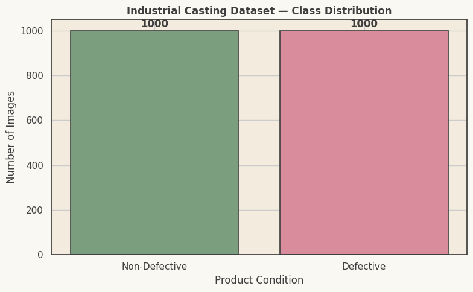

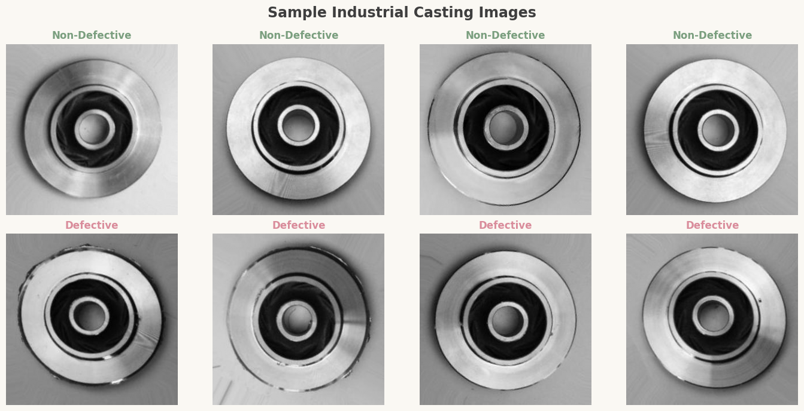

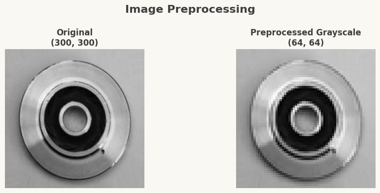

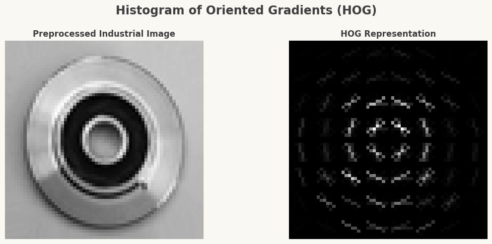

## Classifier Comparison (HOG + SVM vs. HOG + Random Forest)

| Model | Accuracy | Precision | Recall | F1-Score |
|---|---|---|---|---|
| HOG + SVM | 0.9625 | 0.9695 | 0.9550 | 0.9622 |
| HOG + Random Forest | 0.8575 | 0.8667 | 0.8450 | 0.8557 |

### Per-Class Classification Reports

**HOG + SVM**

| Class | Precision | Recall | F1-Score | Support |
|---|---|---|---|---|
| Non-Defective | 0.96 | 0.97 | 0.96 | 200 |
| Defective | 0.97 | 0.95 | 0.96 | 200 |
| **Accuracy** | | | **0.96** | 400 |

**HOG + Random Forest**

| Class | Precision | Recall | F1-Score | Support |
|---|---|---|---|---|
| Non-Defective | 0.85 | 0.87 | 0.86 | 200 |
| Defective | 0.87 | 0.84 | 0.86 | 200 |
| **Accuracy** | | | **0.86** | 400 |

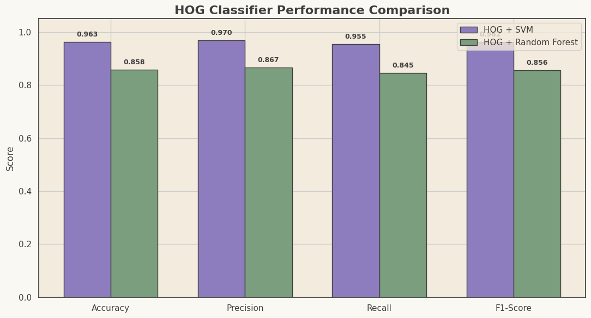

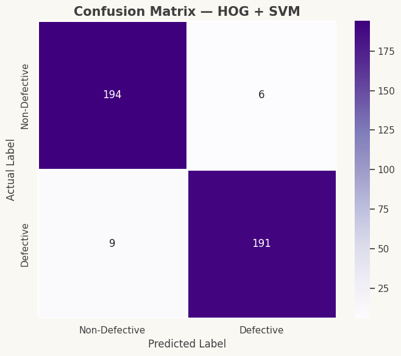

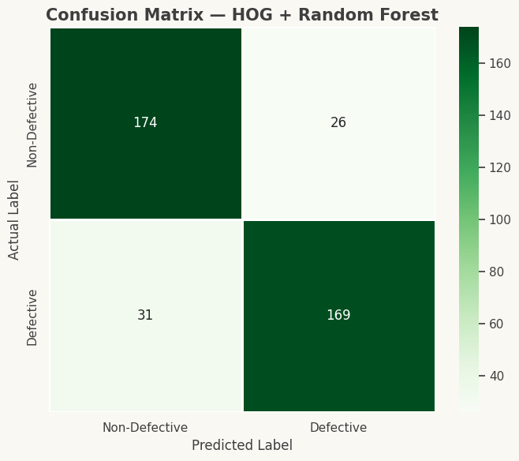

## HOG Parameter Experiment (HOG + SVM)

Sorted by accuracy.

| Cell Size | Orientations | Feature Length | Accuracy | Precision | Recall | F1-Score |
|---|---|---|---|---|---|---|
| 8x8 | 6 | 1176 | 0.9650 | 0.9745 | 0.9550 | 0.9646 |
| 8x8 | 9 | 1764 | 0.9625 | 0.9695 | 0.9550 | 0.9622 |
| 8x8 | 12 | 2352 | 0.9525 | 0.9548 | 0.9500 | 0.9524 |
| 4x4 | 9 | 8100 | 0.9525 | 0.9738 | 0.9300 | 0.9514 |
| 4x4 | 6 | 5400 | 0.9475 | 0.9735 | 0.9200 | 0.9460 |
| 16x16 | 9 | 324 | 0.9425 | 0.9683 | 0.9150 | 0.9409 |
| 4x4 | 12 | 10800 | 0.9400 | 0.9632 | 0.9150 | 0.9385 |
| 16x16 | 12 | 432 | 0.9325 | 0.9529 | 0.9100 | 0.9309 |
| 16x16 | 6 | 216 | 0.9275 | 0.9430 | 0.9100 | 0.9262 |

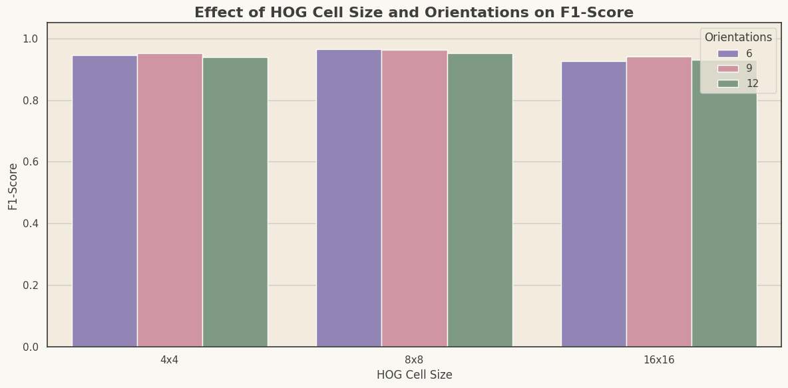

### Best HOG Configuration

| Cell Size | Orientations | Feature Length | Accuracy | Precision | Recall | F1-Score |
|---|---|---|---|---|---|---|
| 8x8 | 6 | 1176 | 0.9650 | 0.9745 | 0.9550 | 0.9646 |

## Robustness Evaluation (Best HOG + SVM)

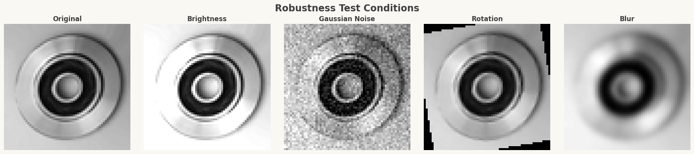

| Condition | Accuracy | Precision | Recall | F1-Score | Accuracy Change | F1 Change |
|---|---|---|---|---|---|---|
| Original | 0.9650 | 0.9745 | 0.9550 | 0.9646 | 0.0000 | 0.0000 |
| Brightness | 0.9025 | 0.8744 | 0.9400 | 0.9060 | -0.0625 | -0.0586 |
| Gaussian Noise | 0.5000 | 0.5000 | 1.0000 | 0.6667 | -0.4650 | -0.2980 |
| Rotation | 0.5000 | 0.5000 | 1.0000 | 0.6667 | -0.4650 | -0.2980 |
| Blur | 0.5175 | 0.5089 | 1.0000 | 0.6745 | -0.4475 | -0.2901 |

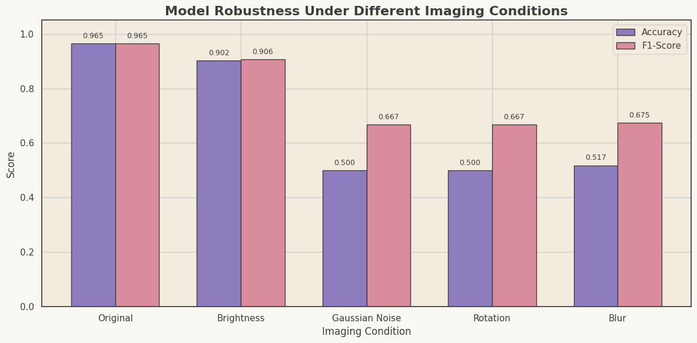

> Under Gaussian noise, rotation, and blur, the model predicts almost everything as "Defective" (recall 1.0, precision ≈ 0.5), i.e. accuracy collapses to roughly chance level.

## Final Product Inspection Demo

| Field | Value |
|---|---|
| Prediction | NON-DEFECTIVE |
| Confidence | 62.39% |
| Action | ACCEPT PRODUCT |

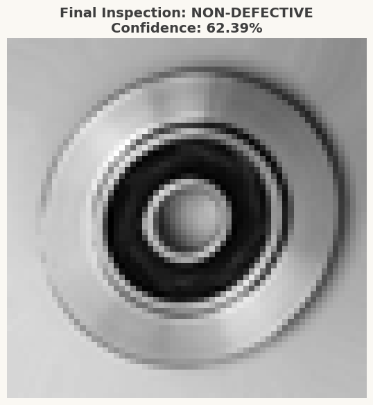
