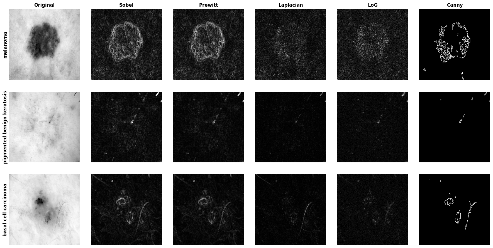
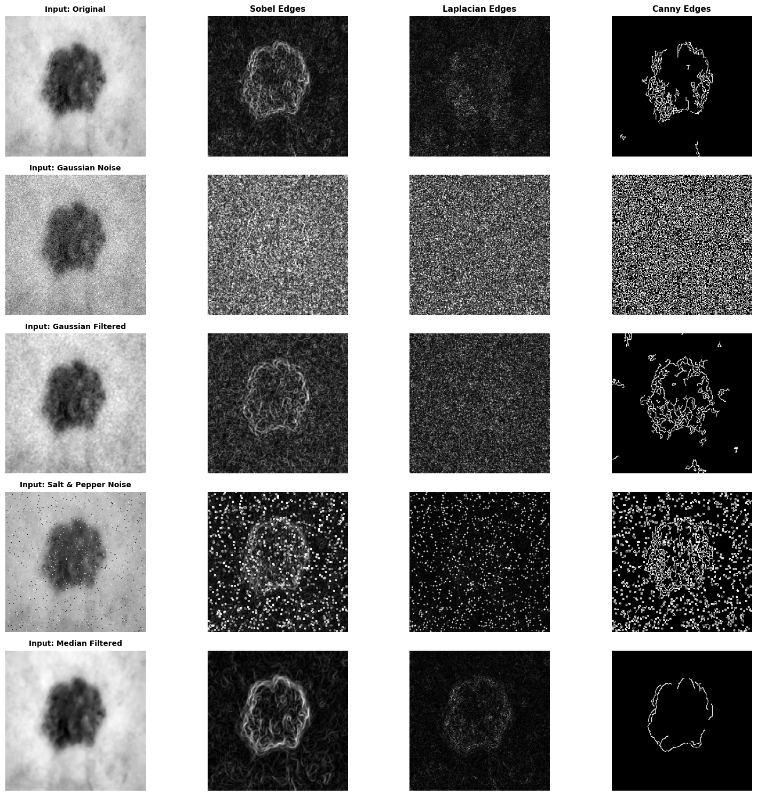
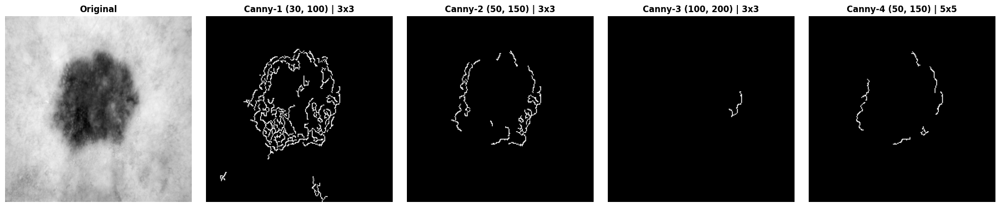
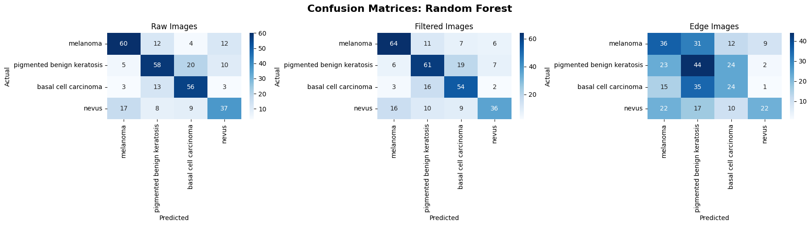
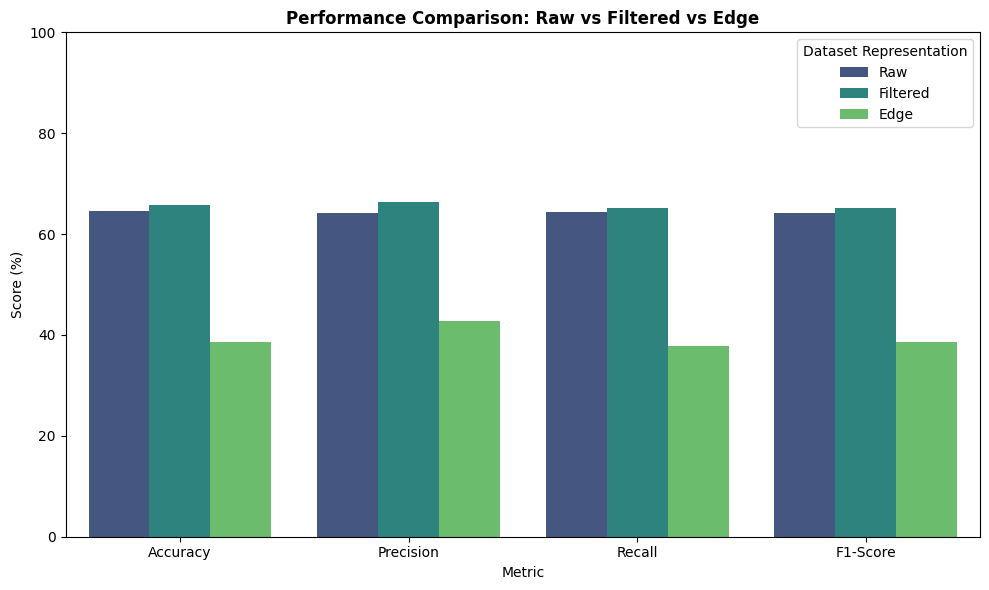

# Lab 03 — Edge Detection: Results

## Task 1: Comparative Edge Detection

## Task 2: Effect of Noise on Edge Detection

### Table 1 — Effect of Noise and Preprocessing on Edge Detection

| Edge Detector | Input Image | Noise Type | Preprocessing | Edge Quality | Noise Sensitivity | Observations |
|---|---|---|---|---|---|---|
| Sobel | Original | None | None | Good | Moderate | Clear lesion contours with minimal background noise. |
| Sobel | Noisy | Gaussian | None | Poor | High | High rate of false edge responses across textured skin. |
| Sobel | Noisy | Salt & Pepper | None | Very Poor | Severe | Impulse noise triggers sharp false edge gradients. |
| Sobel | Noisy | Gaussian | Gaussian Filter | Moderate | Low | Gaussian smoothing suppresses false edges but softens lesion boundary. |
| Sobel | Noisy | Salt & Pepper | Median Filter | Good | Low | Median filter eliminates salt-and-pepper spikes effectively. |
| Prewitt | Original | None | None | Fair | Moderate | Comparable to Sobel but slightly less sensitive to diagonal edges. |
| Laplacian | Original | None | None | Fair | Extreme | 2nd-order derivative doubles zero-crossing response to noise. |
| LoG | Noisy | Gaussian | Gaussian Filter | Moderate | Moderate | Pre-smoothing controls 2nd-derivative noise, preserving key edges. |
| Canny | Original | None | Built-in smoothing | Excellent | Low | Non-maximum suppression and hysteresis give sharp, clean contours. |
| Canny | Noisy | Gaussian | Gaussian Filter | Good | Low | Gaussian pre-filtering plus hysteresis thresholding stays robust. |
| Canny | Noisy | Salt & Pepper | Median Filter | Very Good | Low | Pre-filtering with median filter removes impulse noise before detection. |

## Task 3: Parameter Analysis of Canny Edge Detection

### Table 2 — Canny Parameter Analysis

| Configuration | Low Threshold | High Threshold | Kernel Size | Edge Quality | Number of Detected Edges | Observation |
|---|---|---|---|---|---|---|
| Canny-1 | 30 | 100 | 3x3 | Over-segmented | High | Captures too much skin texture and noise inside the lesion. |
| Canny-2 | 50 | 150 | 3x3 | Optimal | Moderate | Best balance. Clearly traces the main lesion boundary. |
| Canny-3 | 100 | 200 | 3x3 | Under-segmented | Low | Thresholds are too strict, resulting in severe edge loss. |
| Canny-4 | 50 | 150 | 5x5 | Smoothed/Broken | Low-Moderate | Larger Gaussian kernel smooths out too much detail. |

## Tasks 4 & 5: Classification Using Edge Maps

### Table 3 — Model Accuracy Across Labs (Raw vs. Filtered vs. Edge Maps)

| Model / Classifier | Accuracy Raw (Lab 1) % | Accuracy Filtered (Lab 2) % | Accuracy Edge (Lab 3) % | Precision % | Recall % | F1-Score % | Training Time (s) | Inference Time (ms) |
|---|---|---|---|---|---|---|---|---|
| SVM | 62.69 | 59.63 | 34.86 | 37.63 | 33.37 | 32.87 | 13.37 | 5495.02 |
| Random Forest | 64.53 | 65.75 | 38.53 | 42.78 | 37.80 | 38.53 | 3.64 | 47.41 |
| KNN | 57.19 | 58.41 | 33.64 | 34.32 | 31.44 | 23.82 | 0.01 | 467.90 |
| CNN Model 1 | 51.99 | 55.05 | 29.05 | 21.64 | 27.52 | 22.63 | 12.26 | 3263.56 |
| CNN Model 2 | 37.00 | 38.53 | 30.89 | 15.46 | 27.87 | 19.87 | 11.15 | 5021.37 |

## Task 6: Visual Comparison of Classification Results

Best-performing model on edge maps: **Random Forest**.

